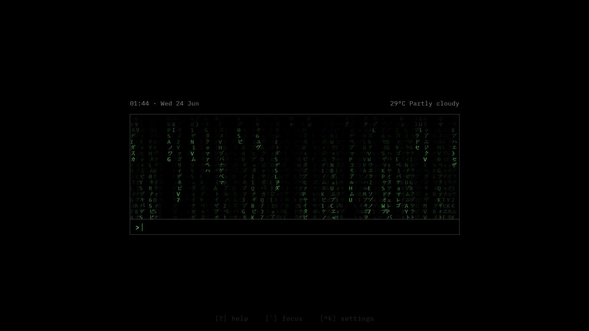

# Startpage_kb

A minimal, keyboard‑driven startpage for your browser.
Execute commands like a terminal – navigate, search, calculate, convert currencies, check the weather, and more.

---

## ✨ Features

https://github.com/user-attachments/assets/b9a7c148-814e-4353-a4c9-b31da5b331dd

- **Alias‑based navigation** – jump to any site with a short keyword (`yt`, `gh`, `gmail`…)
- **Built‑in search shortcuts** – `yt lofi beats` searches YouTube, `gh react` searches GitHub, and many more
- **Powerful calculator** – powered by [math.js](https://mathjs.org/); supports `= 2+2`, `sqrt(144)`, `sin(pi/2)`, etc.
- **World clock** – `time tokyo` shows the current time + UTC offset for most major cities
- **Terminal weather** – `weather paris` fetches current conditions via [wttr.in](https://wttr.in)
- **Currency conversion** – `50 usd to jpy` uses live exchange rates (no API key needed)
- **Fuzzy matching** – typos are forgiven; `yotube` still opens YouTube
- **Domain auto‑detection** – typing `github.com` or `mail.google.com` navigates directly
- **Matrix rain** – animated background (stops when results appear, restarts on `clear`)
- **Theme engine** – 14+ base16 themes (Dracula, Nord, Rosé Pine, Sakura…) switchable from the config panel
- **Custom aliases** – add your own via the `Ctrl+K` overlay
- **Full keyboard control** – see the shortcuts below

---

## 🚀 Getting Started

1. **Clone or download** the repository.
2. Open `index.html` in your browser.
3. Set it as your new tab page (use an extension like [New Tab Redirect](https://chrome.google.com/webstore/detail/new-tab-redirect/icpgjfneehieebagbmdbhnlpiopdcmna) or configure it in your browser’s settings).

That’s it! No build step, no server required.

### Dependencies

- [math.js](https://cdnjs.cloudflare.com/ajax/libs/mathjs/11.8.0/math.min.js) (CDN, loaded in the HTML)
- The currency converter uses the free [open.er-api.com](https://open.er-api.com) service (no key).
- Weather data from [wttr.in](https://wttr.in).

Everything else is vanilla JavaScript, CSS, and HTML.

---

## ⌨️ Keyboard Shortcuts

| Key       | Action |
|-----------|--------|
| `Enter`   | Execute command / accept highlighted suggestion |
| `Tab`     | Autocomplete first suggestion |
| `↑` / `↓` | Cycle through history or suggestions |
| `Esc`     | Close suggestions → Clear input → Close overlays |
| `Ctrl+K`  | Open alias manager |
| `` ` ``   | Focus the command input |
| `?`       | Toggle help overlay |

---

## 📟 Commands

### Navigation & Search

| Input | Result |
|-------|--------|
| `yt` | Open YouTube |
| `yt lofi` | Search YouTube for “lofi” |
| `gh` | Go to GitHub |
| `gh react hooks` | Search GitHub |
| `gmail` | Open Gmail |
| `maps` | Google Maps (or `maps tokyo` to search) |
| `! funny cats` | Force a Google search (bypasses aliases) |
| `github.com` | Navigate directly (auto‑https) |

### Utilities

| Input | Result |
|-------|--------|
| `= 2+2` | Calculator (`4`) |
| `sqrt(16) + pi` | Math expression (`7.14159265359`) |
| `time london` | World clock with offset |
| `weather tokyo` | Current weather via wttr.in |
| `50 usd to eur` | Live currency conversion |
| `clear` or `cls` | Clear output log (matrix rain resumes) |

### Aliases

Built‑in aliases cover popular sites (YouTube, GitHub, Reddit, Twitter, Netflix, MDN, etc.).
Add your own in the config panel (Ctrl+K) – use `%s` as a placeholder for the search query.

---

## 🎨 Themes

14 themes included, all following the base16 system.
Change the theme from the alias manager (Ctrl+K) → “Theme” dropdown.
Your choice is saved automatically.

| Theme | Preview |
|-------|---------|
| Default Dark | Clean dark |
| Nord | Arctic, bluish |
| Dracula | Purple‑ish dark |
| Rosé Pine | Soft, warm dark |
| Mocha | Espresso tones |
| Twilight | Subdued contrast |
| Sakura | Light, pink accent |
| Cupcake | Pastel light |
| … and more | |

---

## 🛠️ Customisation

- **Add aliases**: press `Ctrl+K`, type a keyword and a URL (use `%s` for search).
- **Change theme**: select one from the dropdown in the config panel.
- **Adjust history length**: change `MAX_HISTORY_ROWS` in `app.js`.
- **Matrix rain opacity**: modify `--matrix-opacity` in `styles.css`.
- **Font**: replace the `@import` URL in `styles.css` with your favourite monospace font.

---

---

## 🙏 Credits

- Matrix rain inspired by the classic effect.
- Weather from [wttr.in](https://github.com/chubin/wttr.in).
- Exchange rates from [ExchangeRate-API](https://www.exchangerate-api.com) (open‑source tier).
- Built with the help of AI tools

---

## 📜 License

MIT – do whatever you want, just keep the credits if you share it.
